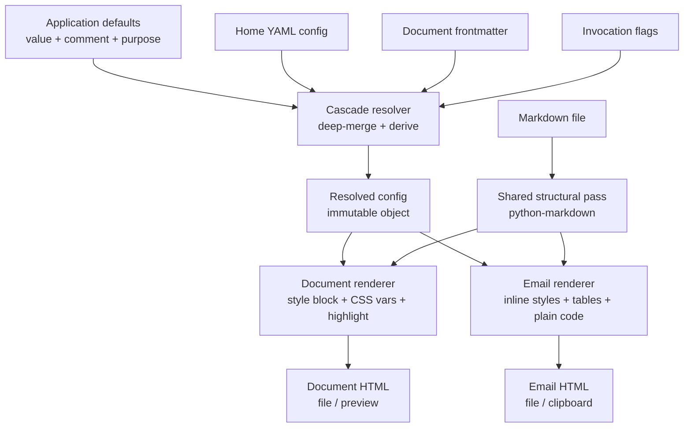
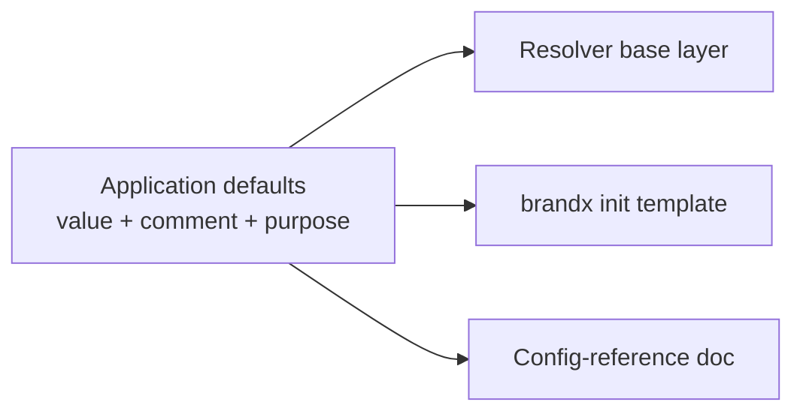

# feat: brandx foundation — generic engine, identity config, and distribution

## Summary

Build brandx from scratch: a generic, identity-free Python tool that renders markdown into a branded document or an Outlook-safe email, driven by a user-owned YAML brand config resolved through a four-layer cascade, installable from a public Git repo with `uv`. Delivery is phased: the config core first (the contract everything depends on), then the engine opened by a visual-design sign-off, then install and distribution.

## Problem Frame

brandx productises the ea-brand prototype (T196), whose output is worth sharing but whose identity and assets are welded into the code. The strategy's spine is "identity is pure data, the engine is generic" (see `STRATEGY.md`). Three brainstorms scope the work: the resolver and config (`docs/brainstorms/2026-06-20-identity-config-requirements.md`), the renderer (`docs/brainstorms/2026-06-20-generic-engine-requirements.md`), and packaging (`docs/brainstorms/2026-06-20-install-distribution-requirements.md`). This plan turns all three into one build. The prototype at `~/projects/ea-brand` is the pattern source for the hard parts (Outlook-safe email, dependency-free syntax highlighting, base64 embedding); its techniques are reproduced, its code is not forked.

## Requirements

**Config and resolution**

- R1. Brand values resolve through four layers, lowest to highest: application defaults, home YAML config, document frontmatter, invocation flags, overriding by identical key names (identity-config R1, R2).
- R2. The application-defaults layer provides a value for every key, so resolution always yields a complete config (identity-config R3).
- R3. The resolver owns all derivation: initials and monogram from the name, the name from the OS account when unset, and a graceful fallback when only a username is exposed (identity-config R6).
- R4. Config is discovered by `--brand PATH`, then `BRANDX_CONFIG`, then the XDG home location; a missing config is not an error (identity-config R8, R9, R10).
- R5. Missing keys default; an unknown key warns; a malformed config errors clearly (identity-config R15).

**Rendering engine**

- R6. The engine renders a markdown file to a branded HTML document and to Outlook-safe email HTML, sharing one semantic pass; email is a graceful degradation of the document (generic-engine R1, R2).
- R7. The feature floor renders: standard markdown, a branded letterhead, GitHub-style callouts, fenced code (highlighted in the document, plain monospace in email), and a print stylesheet on the document surface only (generic-engine R9-R13).
- R8. The engine reads only the resolved config and hardcodes no person-specific value (generic-engine R14, R15, R16).
- R9. Output can be written to a file, copied to the clipboard (macOS), or opened in a browser preview; the identity mark and an alternate config are selectable at invocation (generic-engine R3-R8).

**Distribution**

- R10. brandx installs from the public Git repo with one `uv` command and places a `brandx` command on PATH, on macOS, Windows, and Linux (install R1-R3).
- R11. `brandx init` writes a fully-commented full-palette starter config to the home location and refuses to overwrite an existing one (install R4-R6).
- R12. The `init` template and the config-reference docs are generated from the single application-defaults source (install R7).
- R13. The repo carries an MIT licence, a README with install and quickstart, and a worked example (install R8-R10).

## Key Technical Decisions

- KTD1. **python-markdown as the markdown engine**, with `tables`, `fenced_code`, `attr_list`, `smarty`, and `codehilite` (configured `noclasses: True` so syntax highlighting emits inline-styled spans and needs no stylesheet). Rationale: matches the prototype, the feature floor maps onto these extensions, and `noclasses` is what makes highlighting survive embedding. Accept the known coupling: the styling layer depends on python-markdown's exact HTML output shape.
- KTD2. **Two renderers over one structural pass.** The shared pass produces semantic HTML only; each renderer applies its own styling. The document renderer emits a `<style>` block with CSS variables sourced from the resolved config and applies `codehilite` highlighting; the email renderer emits 100% inline styles in a table-based layout with no `<style>` block and renders code as plain monospace (no pygments spans). Rationale: the prototype's central insight; Outlook ignores `<style>`, `max-width` on divs, and `nth-child`.
- KTD3. **Thread an immutable resolved-config object through the renderers and style builders.** No module-global brand state. Rationale: the prototype's global mutation plus `apply_brand()` is its weakest part; an immutable object makes `--brand` and the cascade trivial and testable.
- KTD4. **The resolver is the sole owner of defaulting and derivation.** The engine renders whatever resolved config it is handed. Rationale: keeps the engine generic; the resolver owns defaulting and derivation (identity-config R6) and the engine renders the resolved config (generic-engine R15).
- KTD5. **Application defaults are the single source of truth, carrying each key's value plus its one-line comment and its purpose text.** The `init` template and the config-reference doc are generated from that source, never hand-maintained, so a new key cannot ship without its comment and purpose. Rationale: prevents drift (install R7, identity-config R3).
- KTD6. **macOS-first clipboard.** Rich-text copy via `osascript ... «class HTML»`; Windows and Linux clipboard deferred. File output and browser preview stay cross-platform; clipboard on an unsupported platform (including a macOS host where `osascript` is unavailable) prints a clear message. Rationale: user decision, testability.
- KTD7. **Document assets: embed images and avatar as base64; load the web font via a Google Fonts `<link>` with a robust fallback stack.** Email: inline everything, embed the avatar as base64, use a web-safe font stack. Rationale: portable enough without the bloat and licensing of embedding font files; email cannot use web fonts at all.
- KTD8. **Reproduce the Outlook-safe primitives as technique, not code:** a presentation-table body wrapper, two-cell coloured-bar-plus-content callouts, a single-cell wrapper around `<pre>`, Python-computed zebra striping, and consecutive-blockquote splitting for stacked alerts. Rationale: prototype research; reproduce the correct `_split_blockquote_paragraphs` behaviour, not the first-match-only variant.
- KTD9. **One `brandx` command with subcommands** (`init` and the render path), exposed as a console entry point so `uv tool install` yields the command. Flag grammar is settled in implementation; the capability set is fixed by the brainstorms.
- KTD10. **Avatars are embedded as supplied, with no image processing.** An optional per-surface email avatar; a warning when an embedded image is heavy and when total email size nears the Gmail clip threshold. Rationale: keeps brandx dependency-light (identity-config decision).
- KTD11. **Brand values are nested; config and frontmatter are nested YAML, flags use flattened dotted keys.** The colour palette is a nested block (as in the prototype's `brand.json`). The home config and document frontmatter are parsed as real YAML via `pyyaml`, and the resolver deep-merges nested mappings so a single `accent` override leaves the rest of the palette intact. Invocation flags address nested keys through a flattened dotted form (for example `--colours.accent`). Rationale: the uniform cascade (R1) must reach nested palette keys at every layer; the prototype's flat frontmatter splitter cannot, so frontmatter parsing is built fresh, not reused.

## High-Level Technical Design

Two shapes carry the design: the resolution-and-render flow, and the defaults-as-single-source fan-out.





## Output Structure

Greenfield package, src layout:

```text
brandx/
  pyproject.toml          # packaging, console entry point, deps
  README.md
  LICENSE                 # MIT
  src/brandx/
    __init__.py
    cli.py                # argparse: init + render subcommands
    config/
      defaults.py         # value + comment + purpose per key (single source)
      schema.py           # key set, validation, warnings
      discovery.py        # --brand > BRANDX_CONFIG > XDG location
      resolver.py         # four-layer cascade deep-merge + derivations
    render/
      pipeline.py         # shared structural pass + frontmatter (YAML)
      callouts.py         # alert detection + consecutive-blockquote split
      assets.py           # base64 image/avatar embedding, size warnings
      document.py         # document renderer (style block + CSS vars + highlight)
      email.py            # email renderer (inline tables, plain code, Outlook-safe)
    output.py             # file / preview destinations
    clipboard.py          # macOS rich-text backend; others deferred
    initcmd.py            # init scaffolding from defaults
    docsgen.py            # config-reference generation from defaults
  tests/                  # see per-unit test files
  examples/
    sample-note.md        # worked example
  docs/
    config-reference.md   # generated from defaults
```

The per-unit `**Files:**` lists are authoritative; the tree is the expected shape, adjustable during implementation.

## Implementation Units

Units are grouped into four phases. Phase B (design) gates Phase C (the renderers) but runs in parallel with Phase A.

### Phase A — Config core

### U1. Project scaffold and packaging

- Goal: a `uv`-installable package skeleton with a `brandx` console entry point and an MIT licence.
- Requirements: R10, R13.
- Dependencies: none.
- Files: `pyproject.toml`, `src/brandx/__init__.py`, `src/brandx/cli.py` (stub), `LICENSE`, `tests/test_cli.py`.
- Approach: src layout; declare the console entry point so `uv tool install git+<repo>` exposes `brandx`; pin a Python floor (see Open Questions); dependencies are `markdown`, `pygments`, and `pyyaml` (config and frontmatter are real YAML, see KTD11). Pin the `markdown` version (the styling layer is coupled to its output). CLI stub wires `init` and render subcommands that error "not yet implemented".
- Patterns to follow: prototype CLI shape (argparse, stderr-only status so output stays clean).
- Test scenarios: `brandx --help` lists both subcommands; the entry point imports without error. Covers R10.
- Verification: `uv tool install .` in a clean environment yields a working `brandx` command.

### U2. Application defaults and brand schema

- Goal: the complete default brand set in code (the single source) plus the key schema.
- Requirements: R1, R2, R5, R12.
- Dependencies: U1.
- Files: `src/brandx/config/defaults.py`, `src/brandx/config/schema.py`, `tests/test_schema.py`.
- Approach: enumerate every brand key (identity: name, role, initials; the full nested colour palette seeded from the prototype's `brand.json`; fonts with family, fallback stack, web-font URL; date format; avatar and optional email avatar) with a default for each, plus a one-line comment and a purpose string per key, so `init` and the config reference derive everything, not just values. Keep the HTML-vs-email colour split. Defaults are an immutable structure consumed as the resolver's base layer and serialised by `init` and the docs generator.
- Patterns to follow: `brand.json` key set (prototype), minus person-specific values and the unused `auto_logo`.
- Test scenarios: every schema key has a default, a comment, and a purpose; the default set validates clean; an unknown key is reported by the validator. Covers R2, R5.
- Verification: the default set renders a usable document with no other input (proven in U7).

### U3. Config discovery and loading

- Goal: locate and parse the home config with the correct precedence and lenient validation.
- Requirements: R4, R5.
- Dependencies: U2.
- Files: `src/brandx/config/discovery.py`, `tests/test_discovery.py`.
- Approach: resolution order `--brand PATH` then `BRANDX_CONFIG` then `~/.config/brandx/brand.yaml` (honour `XDG_CONFIG_HOME`; `%APPDATA%\brandx\` on Windows). Parse the config as YAML via `pyyaml`, preserving nested keys. Missing file returns an empty layer, not an error. Malformed YAML raises a clear error naming the file; unknown keys warn to stderr.
- Patterns to follow: prototype's stderr-only status convention.
- Test scenarios: `--brand` wins over `BRANDX_CONFIG` which wins over the default path; missing file yields an empty layer and no error; malformed YAML raises a clear error; an unknown key warns but still loads. Covers identity-config AE6, R4, R5.
- Verification: discovery returns the expected source given each combination of inputs.

### U4. Cascade resolver

- Goal: deep-merge the four layers and apply derivations into an immutable resolved-config object.
- Requirements: R1, R2, R3.
- Dependencies: U2, U3.
- Files: `src/brandx/config/resolver.py`, `tests/test_resolver.py`.
- Approach: deep-merge defaults, home config, frontmatter, then flags, by identical key names (highest present wins), preserving nested mappings so a single `accent` override leaves the rest of the palette intact (KTD11). After merge, derive: initials and monogram from the name; the name from the OS account when unset at every layer; a graceful fallback when the OS exposes only a username (the fallback title-cases the username and derives initials from it). OS full-name lookup is platform-specific new code (macOS Directory Services, Unix GECOS, a Windows API), is often empty, and then collapses to the username fallback; tests mock the platform call. Resolve avatar references to readable paths and fall the email avatar back to the main avatar when absent. Return a frozen object threaded into the renderers.
- Patterns to follow: prototype `_initials()` for the monogram; replace its global mutation with the immutable object (KTD3).
- Test scenarios: a key set in frontmatter overrides the same key in the home config (Covers identity-config AE1); a nested colour key (`accent`) set in frontmatter overrides only that palette entry, leaving the rest intact; no name anywhere plus a mocked OS full name yields that name and its initials (Covers identity-config AE3); a username-only OS account yields the graceful fallback, not the raw username (Covers identity-config AE4); absent email avatar falls back to the main avatar (Covers identity-config AE5, the fallback half); a flag overrides frontmatter. Covers R1, R3.
- Verification: resolution is complete and deterministic for every layer combination.

### Phase B — Visual design (gates Phase C)

### U5. Visual design and sign-off

- Goal: agree the fresh visual system for both surfaces before any renderer is built.
- Requirements: R6, R7.
- Dependencies: U2 (needs the palette/identity vocabulary); may run alongside Phase A.
- Files: `docs/design/` mockups (HTML or image), reviewed with Richard.
- Approach: produce mockups of the letterhead, section headings, callouts, tables, code blocks, and the two surfaces (document and Outlook email), as a fresh blank-canvas design rather than a reproduction of T196. Iterate to Richard's sign-off. The signed-off mockups are the spec U7 and U8 build against.
- Execution note: produce mockups and obtain sign-off before starting U7/U8. If sign-off slips, U7/U8 are blocked; escalate rather than guess the design.
- Test scenarios: Test expectation: none -- design artifact, not behaviour.
- Verification: Richard signs off the mockups for both surfaces.

### Phase C — Rendering engine

### U6. Shared structural pass

- Goal: the common structural pass both renderers consume, plus frontmatter parsing and shared asset embedding.
- Requirements: R6, R7.
- Dependencies: U1.
- Files: `src/brandx/render/pipeline.py`, `src/brandx/render/callouts.py`, `tests/test_pipeline.py`, `tests/test_callouts.py`.
- Approach: build the python-markdown instance with the KTD1 extensions, producing structural HTML only (per-surface styling is each renderer's job). Parse frontmatter as nested YAML via `pyyaml`, shared with the cascade. Title falls back to the first H1, which is then stripped from the body so it does not render twice. Detect GitHub callouts from the rendered blockquotes, splitting consecutive alerts in one merged blockquote into separate callouts. Reset the markdown instance between conversions to avoid cross-document state.
- Patterns to follow: prototype `_split_blockquote_paragraphs` (the correct splitter), first-heading-strip with a tracked flag. Note: the prototype's flat frontmatter splitter is not reused; frontmatter is real YAML here.
- Test scenarios: stacked `[!NOTE]` and `[!WARNING]` in one blockquote split into two callouts; a blockquote with no marker stays a plain blockquote; missing-title uses the first H1 and removes it from the body; a file with no frontmatter parses cleanly; nested frontmatter keys parse into a nested mapping. Covers R7.
- Verification: the pipeline yields the expected intermediate structure for callouts, titles, and plain blockquotes.

### U7. Document renderer

- Goal: render the branded HTML document from the resolved config and the structural pass.
- Requirements: R6, R7, R8.
- Dependencies: U4, U5, U6.
- Files: `src/brandx/render/document.py`, `src/brandx/render/assets.py`, `tests/test_document_render.py`, `tests/test_assets.py`.
- Approach: emit a `<style>` block with CSS variables built from the resolved palette and fonts; compose the signed-off letterhead (mark, name, role, date in the resolved date format); render headings as brand elements, tables, callouts, highlighted code (`codehilite noclasses`), and a `@media print` stylesheet. Provide the shared `assets.py` base64 embedding helper (skip http(s) and `data:` srcs, warn on missing files) used by both renderers. Embed images and the avatar as base64; load the web font via `<link>` with the fallback stack. Build the mark as monogram or avatar per the resolved selection.
- Patterns to follow: prototype `ea2html` CSS-variable injection, gradient-bar letterhead concept, print styles, `embed_images`, `_resolve_doc_date` long-British rendering as one date-format option.
- Test scenarios: output contains a `<style>` block and `:root` CSS variables from the config; the print media block is present; a fenced code block is syntax-highlighted; a local image becomes a `data:` URI; an http(s) image is left untouched; the default renders the monogram (Covers generic-engine AE2) and `mark: avatar` renders the avatar (Covers generic-engine AE4). Covers R6, R7, R8.
- Verification: the rendered document opens in a browser matching the signed-off mockup.

### U8. Email renderer

- Goal: render Outlook-safe email HTML as a graceful degradation of the document.
- Requirements: R6, R7, R8.
- Dependencies: U4, U5, U6, U7 (reuses `assets.py`).
- Files: `src/brandx/render/email.py`, `tests/test_email_render.py`.
- Approach: emit 100% inline styles with a table-based layout and no `<style>` block. Reproduce the Outlook primitives (KTD8): presentation-table body wrapper, bar-plus-content callouts, single-cell `<pre>` wrapper, Python-computed zebra striping. Render code as plain inline-styled monospace, not highlighted: do not enable `codehilite` on the email path. Note this diverges from the prototype, whose email retains pygments inline spans; the email renderer must avoid or strip those spans. Reuse U7's `assets.py` to embed the avatar (email avatar when present) as base64; use the web-safe font stack. Warn when an embedded image is heavy and when total size nears the Gmail clip threshold.
- Patterns to follow: prototype `ea2email` table primitives, `embed_images`, the Gmail clip-size warning, the HTML-vs-email colour split.
- Test scenarios: output contains no `<style>` block and no class-based or inline-coloured syntax spans; structural elements carry inline `style=`; a code block renders as plain monospace, not highlighted (Covers generic-engine AE1, the email half); the body uses presentation tables; zebra striping alternates per row; a large embedded avatar triggers a size warning (Covers generic-engine AE5); a golden-HTML snapshot guards structural drift between manual checks. Covers R6, R7, R8 and generic-engine AE5 (email survives Outlook structurally).
- Verification: automated structural assertions and the golden snapshot pass; a manual paste into Outlook renders correctly (the check automation cannot cover).

### U9. CLI render command and output destinations

- Goal: wire the render path, flags, and output destinations.
- Requirements: R9.
- Dependencies: U4, U7, U8.
- Files: `src/brandx/cli.py`, `src/brandx/output.py`, `src/brandx/clipboard.py`, `tests/test_output.py`, `tests/test_cli.py`.
- Approach: build out the CLI stub from U1 into one render invocation selecting document or email, with destinations file, clipboard (macOS), and browser preview, plus mark selection and `--brand`. Flags mirror config key names (nested keys via the dotted form, KTD11) so they form the top cascade layer. Clipboard uses the macOS rich-text backend; on Windows or Linux, or when `osascript` is unavailable, it prints a clear "clipboard unsupported here" message and suggests file output.
- Patterns to follow: prototype output precedence (preview keeps the temp file, clipboard deletes it), `osascript «class HTML»` rich-text copy, the platform open command for preview.
- Test scenarios: render-to-file writes the expected surface; preview opens a temp file; clipboard on macOS places rich text; clipboard on a non-macOS platform prints the unsupported message and exits non-fatally; `--brand` selects an alternate config for the render. Covers R9.
- Verification: each destination behaves as specified on macOS; non-macOS clipboard degrades with a clear message.

### Phase D — Install and distribution

### U10. `brandx init`

- Goal: scaffold a starter config from the defaults source.
- Requirements: R11, R12.
- Dependencies: U2.
- Files: `src/brandx/initcmd.py`, `tests/test_init.py`.
- Approach: serialise the application defaults to a fully-commented YAML file (every key shown with its default and its one-line comment from the defaults source) at the home location, creating the directory if needed. Refuse to overwrite an existing config; prompt or exit with guidance.
- Patterns to follow: KTD5 single-source serialisation.
- Test scenarios: with no config, `init` writes a fully-commented full-palette file whose keys and comments match the defaults source; run again, it refuses to overwrite (Covers install AE2); the target directory is created when absent. Covers R11, R12.
- Verification: a fresh `init` produces a config that round-trips through the resolver to the default rendering.

### U11. Config-reference generation

- Goal: generate the config-reference doc from the defaults source.
- Requirements: R12.
- Dependencies: U2.
- Files: `src/brandx/docsgen.py`, `docs/config-reference.md`, `tests/test_docsgen.py`.
- Approach: render every key, its default, and its purpose text from the defaults source into a reference document, so the docs cannot drift from the code. (A small module rather than a function only because the generated artifact is a distinct deliverable; collapse into `initcmd.py` if no second consumer emerges.)
- Patterns to follow: KTD5.
- Test scenarios: the generated reference lists every default key with its purpose; a changed default appears in the regenerated reference without hand edits (Covers install AE3). Covers R12.
- Verification: regenerating after a defaults change updates the reference automatically.

### U12. README, quickstart, and worked example

- Goal: the docs a technical stranger needs to adopt brandx.
- Requirements: R13.
- Dependencies: U9, U10.
- Files: `README.md`, `examples/sample-note.md`.
- Approach: README covers install (`uv tool install git+<repo>`), a quickstart (`init`, render a document, render an email), the update path (`uv tool install --upgrade git+<repo>`), and points at the generated config reference. Ship a worked example with the commands to render it.
- Patterns to follow: prototype README structure.
- Test scenarios: Test expectation: none -- documentation. Verify the quickstart commands run end to end against the built CLI.
- Verification: a new user can follow the README from install to a rendered document and email.

## Scope Boundaries

**Deferred for later**

- PyPI publishing and the `uv tool install brandx` / `uvx` commands, plus versioned releases and a release pipeline (install doc).
- Windows and Linux clipboard backends (user decision; macOS-first).
- RAG status colours (generic-engine doc).
- Multiple named brand profiles (identity-config doc).

**Outside the product's identity**

- Image processing or resizing of avatars; supplied images are embedded as-is.
- A brandx skill or any markdown-authoring logic; brandx only applies branding.
- Batch or multiple-file input; one file per invocation.

## Risks and Dependencies

- The styling layer is a set of regex passes coupled to python-markdown's exact HTML serialisation. Not just a version bump but the enabled extensions can desync it (for example `attr_list` injecting attributes onto tags the regexes match), so pin the `markdown` version and treat extension changes as breaking. Acceptable, but stated.
- Outlook rendering cannot be fully tested in automation; U8 carries a golden-HTML snapshot for structural drift plus a manual paste-into-Outlook verification step for true fidelity.
- OS full-name lookup is platform-specific new code (not in the prototype) and is often empty; the username fallback (R3) is the common path, and U4's tests mock the platform call. The fallback's output shape (title-cased username, derived initials) is fixed in U4.
- Git-first install assumes a public repo host reachable by `uv`.

## Sources and Research

- Requirements: `docs/brainstorms/2026-06-20-identity-config-requirements.md`, `docs/brainstorms/2026-06-20-generic-engine-requirements.md`, `docs/brainstorms/2026-06-20-install-distribution-requirements.md`.
- Strategy: `STRATEGY.md`.
- Prototype patterns (reproduce technique, not code): `~/projects/ea-brand` (`ea2email.py`, `ea2html.py`, `brand.json`). Load-bearing techniques carried into KTDs: the two-renderer split, `codehilite noclasses` (document only), the Outlook table primitives, consecutive-blockquote splitting, base64 embedding with http/data skip, the Gmail clip-size warning, the macOS rich-text clipboard, and the redesign away from module-global brand state. Note two deliberate divergences from the prototype: frontmatter is parsed as real nested YAML (the prototype uses a flat splitter), and email code is rendered plain (the prototype's email keeps pygments spans).

## Open Questions

**Deferred to implementation**

- The minimum Python version and how `uv` pins it (a modern floor such as 3.11+ is assumed).
- The exact flag grammar, including the dotted form for nested keys (KTD11).
- The date-format representation (a strftime pattern versus a small set of named formats).
- The heavy-avatar and Gmail-clip warning thresholds.
