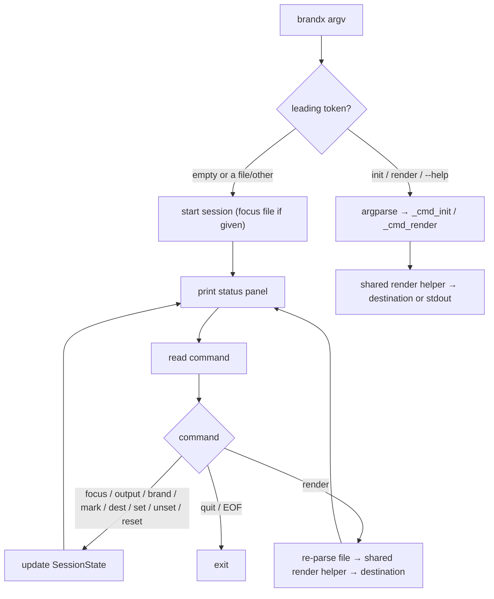

# feat: Interactive render session

## Summary

Add a persistent interactive brandx session. Running bare `brandx` (optionally `brandx <file.md>`) drops into a stdlib line-driven REPL that focuses a markdown file, shows an always-visible status panel of the resolved settings, and lets the user set and re-set render options and re-render in place. The one-shot `brandx render` stays unchanged. Build is gated behind a mockup review of the panel layout and command vocabulary before the loop is implemented.

## Problem Frame

`brandx render` is a stateless one-shot: every render is a full command line, and nothing shows the current settings or which options exist, so each invocation is recalled from memory. A single document often needs several passes (document preview, then email-to-clipboard, maybe a `--set` colour override). The friction is recall, not typing — there is no visible state to tweak from and no in-place discovery of what can change.

---

## Requirements

Traced from the origin brainstorm (see origin: `docs/brainstorms/2026-06-23-interactive-render-session-requirements.md`).

**Session lifecycle**

- R1. Running `brandx` with no subcommand starts a persistent session until the user explicitly exits; `brandx <file.md>` starts it focused on that file. `init` and `render` stay explicit subcommands.
- R2. The session can focus a markdown file at start and re-focus a different file mid-session without restarting.
- R3. `brandx render` remains a pure one-shot command, unchanged, including its pipeable stdout path.

**Visible state and discovery**

- R4. After every command the session reprints a status panel showing the current resolved settings: focused file, document vs email, brand, mark, and destination.
- R5. The options that can be changed are discoverable from within the session, so the user never recalls flags from memory.

**Options and rendering**

- R6. The user can set and re-set each option (document/email, brand, mark, destination, and individual config overrides) within the session, with each change reflected in the panel.
- R7. Settings are sticky across renders within a session; an explicit reset returns an option, or all options, to its default.
- R8. Rendering re-reads and re-parses the focused file each time, so edits made in an external editor are picked up on the next render without restarting.
- R9. In-session destinations are preview, clipboard, and file; stdout is not a session destination.

**Forward compatibility**

- R10. The session is structured so a full arrow-key TUI panel can replace the line-driven loop later without changing the option model or render behaviour.

**Process**

- R11. The panel layout and command vocabulary are reviewed and signed off before the loop is built.

---

## Key Technical Decisions

- **Loop on stdlib `cmd.Cmd`.** Zero new dependency (honours the engine's stdlib-only stance), and it provides command dispatch (`do_*`), a `postcmd` hook to reprint the panel after every command, `help_*` for discovery, and `cmdqueue` for scripted in-process tests. Line-driven is exactly the brainstorm's interim shape.

- **Option state lives in a plain `SessionState`, separate from the `cmd.Cmd` subclass.** The loop reads and mutates a dataclass; rendering the panel and resolving config take that dataclass as input. This is what makes R10 real — a future TUI replaces the loop and panel I/O without touching the option model or the render call.

- **Re-resolve, never mutate.** `ResolvedConfig` is immutable. Every option change and every panel render re-runs the same cascade `_cmd_render` uses (`load_home_config` then `resolve(...)` with the accumulated flags), so the panel always shows what the next render will actually produce.

- **Extract a shared render helper.** Pull the load/parse/resolve/render core (steps 1-5 of `_cmd_render`) into one helper that both the one-shot `render` and the session call, so the two paths can't drift. `render`'s external behaviour stays identical; this is an internal refactor.

- **Entry dispatch via a light pre-parse in `main()`, not an argparse root positional.** A root positional mixed with subparsers is order-sensitive and collides on the `init`/`render` tokens. Instead `main()` inspects argv: empty or a leading non-subcommand, non-flag token routes to the session (focused on that token when present); a leading `init`/`render`/`--help`/`--version` routes to argparse as today. Consequence: bare `brandx` now starts the session instead of printing help; help is `brandx --help` or the in-session `help`.

- **Render is an explicit command.** Toggling an option updates the panel but does not auto-render, so changing options never fires an unwanted browser preview or clipboard write.

---

## High-Level Technical Design

Entry dispatch and the command loop. The unchanged `render` path is shown for contrast.



Draft status panel (the artifact U1 reviews and finalises):

```text
brandx · interactive session
──────────────────────────────────────────────────────
  file     note.md
  output   document          (document | email)
  brand    ~/.config/brandx/brand.yaml   (Richard Cowin)
  mark     monogram          (monogram | avatar)
  dest     preview           (preview | clipboard | file)
  set      colours.accent=#e63946
──────────────────────────────────────────────────────
  commands: focus  output  brand  mark  dest  set  unset
            render  reset  status  help  quit
brandx>
```

---

## Implementation Units

### U1. Session UX mockups and review pause

**Goal:** Produce text mockups of the status panel and a sample end-to-end session transcript, plus the finalised command vocabulary, then pause for review and sign-off before any loop code is written.

**Requirements:** R4, R5, R11.

**Dependencies:** none.

**Files:**
- `docs/design/mockup-session.md` (new) — panel layouts (empty/unfocused, focused, email mode, file destination), a sample transcript showing focus → tweak → render → switch-to-email → render, and the command table with one-line help for each.

**Approach:** Start from the draft panel in High-Level Technical Design. Show the panel in several states so the spacing and the "(option | choices)" hint convention are concrete. Settle the command names and argument shapes (e.g. `output document|email`, `dest preview|clipboard|file <path>`, `set key=value`, `unset key`, `reset [option|all]`). Capture the empty-state messaging (render with no focused file prompts `focus`) and the clipboard-unsupported message wording.

**Execution note:** This unit ends in a review pause. Do not begin U2 or U4 until the mockup and command vocabulary are approved; approval may revise panel layout, command names, or argument shapes, which then feed U2 and U4.

**Test expectation:** none — documentation artifact and review checkpoint.

**Verification:** `docs/design/mockup-session.md` exists with panel states, a sample transcript, and the command table; reviewer has signed off on layout and vocabulary.

### U2. Session state model and status panel renderer

**Goal:** A plain `SessionState` dataclass and a pure panel-rendering function that turns state plus resolved config into the panel string.

**Requirements:** R4, R6, R7, R10.

**Dependencies:** U1.

**Files:**
- `src/brandx/session.py` (new) — `SessionState` (focused file, email bool, brand path, mark, set-flags dict, destination kind and optional path) and `render_panel(state, cfg, source_label) -> str`.
- `tests/test_session.py` (new).

**Approach:** `SessionState` holds only option state, no I/O, no `cmd` coupling. `render_panel` reads resolved values from `ResolvedConfig` (`cfg.name`, `cfg.mark`, `cfg.colours[...]`) and session-only fields (output mode, destination) plus the brand `source_label` from `load_home_config`. The `cfg` passed in must be resolved with the focused file's frontmatter (the caller re-parses, or reuses the last parse) so the panel matches what the next render produces; an unfocused session resolves with no frontmatter. Provide a helper to build the `flags` dict from state, mirroring `_cmd_render` lines 128-141 (the `--set` entries plus `identity.mark`), so state resolves the same way a one-shot would.

**Patterns to follow:** the flags-building and `resolve(...)` call in `_cmd_render` (`src/brandx/cli.py:128-146`); `ResolvedConfig` attribute access (`src/brandx/config/resolver.py`).

**Test scenarios:**
- Panel for an unfocused new session shows no file and the configured defaults (output document, mark from config, no overrides).
- Covers AE1. Panel reflects an override: a session with `colours.accent` set shows the new accent value, not the default, after the flags resolve.
- Covers AE3. Reset returns to default: clearing a brand override leaves the panel showing the configured default brand.
- `SessionState` round-trips multiple overrides and an `unset` removes exactly one without disturbing the others.
- Building flags from state with a `mark` set produces `identity.mark` exactly as `_cmd_render` would.

**Verification:** `render_panel` output matches the approved mockup shape for each state; tests green under pytest.

### U3. Shared render helper

**Goal:** Extract the load/parse/resolve/render core shared by the one-shot and the session, leaving `render`'s behaviour unchanged.

**Requirements:** R3, R8.

**Dependencies:** none.

**Files:**
- `src/brandx/cli.py` — add a helper (e.g. `build_html(input_path, *, email, brand_path, mark, set_flags) -> tuple[str, ResolvedConfig, str]`) returning rendered HTML, the resolved config, and the brand source label; refactor `_cmd_render` to call it before destination dispatch.
- `tests/test_cli.py` — existing render tests must stay green; add a direct test of the helper.

**Approach:** Move steps 4-5 of `_cmd_render` (`src/brandx/cli.py:107-149`) — load config, parse, resolve, render — into the helper. The helper raises a typed error (e.g. `RenderInputError`) for a missing input file or a bad brand config rather than calling `sys.exit`/`print; return 1` itself, so both callers control their own response: `_cmd_render` catches it and returns exit 1, the session catches it and prints the message while keeping the loop alive. Raw `--set` `KEY=VALUE` string validation stays in `_cmd_render`'s arg parsing; the helper receives an already-validated `flags: dict[str, str]`, and the session builds `flags` directly from `SessionState` (it never handles raw `KEY=VALUE` strings). Destination dispatch (`--clipboard > -o > --preview > stdout`) stays in `_cmd_render`. The session calls the helper then routes to `preview` / `copy_html` / `write_file` per its destination. Re-parsing on each call satisfies R8 for free (`parse_document` re-reads from disk).

**Patterns to follow:** the existing `_cmd_render` structure and its error messages (`src/brandx/cli.py`).

**Test scenarios:**
- Helper returns HTML, a resolved config, and a source label for a valid file with default options.
- Helper applies `email=True` and produces the email renderer's output, not the document renderer's.
- Helper applies a `set_flags` override and the override is visible in the resolved config it returns.
- Existing `render` CLI tests (document, email, clipboard, output-file, preview, stdout, bad `--set`, missing file) still pass unchanged.

**Verification:** `brandx render` produces byte-identical output to before for each destination; the helper is covered directly.

### U4. Interactive session loop

**Goal:** A `cmd.Cmd` subclass that drives the session: commands to focus and set options, an explicit render, the panel reprinted after every command, and clean exit.

**Requirements:** R1, R2, R4, R5, R6, R7, R8, R9, R10.

**Dependencies:** U1, U2, U3.

**Files:**
- `src/brandx/session.py` — the `cmd.Cmd` subclass and a `run_session(focused_file=None) -> int` entry function.
- `tests/test_session.py` — drive via `cmdqueue` / scripted input.

**Approach:** `do_*` methods for `focus`, `output`, `brand`, `mark`, `dest`, `set`, `unset`, `render`, `reset`, `status`, and `quit`/`EOF`, each mutating `SessionState` (never `ResolvedConfig`). `postcmd` re-resolves config and reprints the panel via `render_panel`. `do_render` re-parses the focused file and calls the U3 helper, then dispatches to `preview` / `copy_html` / `write_file` by the session destination; `copy_html` returning `False` (non-macOS) surfaces a visible message rather than looping silently. Render with no focused file prints the empty-state prompt. A bad brand path or malformed brand YAML must not kill the session: today `load_home_config` calls `sys.exit` on a missing or malformed explicit brand file (`src/brandx/config/discovery.py`), so the loop must guard the re-resolve (validate the brand path on `do_brand`, or catch the failure) and print an error while keeping the session alive. The loop owns only I/O and dispatch; all option logic stays in `SessionState`, keeping R10's TUI swap clean.

**Execution note:** Establish the input seam this repo lacks — drive the loop in tests through `cmd.Cmd`'s `cmdqueue` (or a scripted `stdin`) with `capsys` assertions on the reprinted panel.

**Test scenarios:**
- Happy path: focus a file, switch output to email, set destination to clipboard, render — the (patched) clipboard receives email HTML and the panel reflects each change.
- Covers AE2. External edit picked up: render once, rewrite the focused file on disk, render again — the second output reflects the edited content.
- Covers AE3. Reset returns to default: apply a brand override, `reset` it, render — the configured default brand is used.
- `render` with no focused file prints the empty-state prompt and does not raise.
- `dest file` without a path is rejected with a clear message; `dest file out.html` then `render` writes to that path.
- Setting `brand` to a non-existent path surfaces an error and the session continues (no `SystemExit`).
- Clipboard on a non-macOS platform (patched) surfaces the unsupported message and the loop continues.
- `quit` and EOF both exit the loop returning 0.
- `help` lists the command set; unknown command prints guidance without crashing.

**Verification:** a scripted session reproduces the U1 transcript; panel reprints after each command; tests green.

### U5. Wire entry point

**Goal:** Launch the session on bare `brandx` and `brandx <file.md>` without disturbing `init`/`render`.

**Requirements:** R1, R3.

**Dependencies:** U4.

**Files:**
- `src/brandx/cli.py` — pre-parse dispatch in `main()` replacing the current help-printing `else` branch (`src/brandx/cli.py:182-184`); update the module docstring/usage.
- `tests/test_cli.py` — dispatch tests.

**Approach:** In `main()`, before handing to argparse, inspect `argv`: if empty, run the session unfocused; if the leading token is `init`, `render`, `-h`/`--help`, or `--version`, parse as today; otherwise treat the leading token as a focused file path and run the session. Keep `main()`'s `sys.exit(code)` contract so existing test conventions hold. A leading token that looks like a file but does not exist still enters the session, which then reports the missing file via its focus path (consistent with R2), rather than an argparse error.

**Test scenarios:**
- `brandx` with no args starts the session (patched loop) unfocused and exits 0.
- `brandx note.md` starts the session focused on `note.md`.
- `brandx render note.md` and `brandx init --force` still route to the one-shot commands unchanged.
- `brandx --help` and `brandx --version` still print help/version and do not start the session.

**Verification:** all four routes behave as specified; existing CLI tests pass.

### U6. Document the session

**Goal:** README coverage of the interactive session so a new user discovers it.

**Requirements:** R5.

**Dependencies:** U5.

**Files:**
- `README.md` — a short "Interactive session" section: launching, the panel, the command table, and how it relates to one-shot `render`.

**Approach:** Mirror the approved U1 command table and a trimmed transcript. Keep it brief and consistent with the existing usage-examples style.

**Test expectation:** none — documentation.

**Verification:** README shows how to start a session and lists the commands; matches the shipped vocabulary.

---

## Scope Boundaries

**Deferred for later**

- PDF and image export — a separate track, noted in the origin but not designed or built here.
- The full arrow-key TUI panel — the line-driven session is structured to accept it later (R10), but it is not built now.
- File-watching or automatic re-render on change — the loop stays manual; R8 covers picking up edits on the next explicit render.

**Outside this product's identity**

- Markdown authoring or editing inside the session. brandx applies branding; producing or editing the markdown stays with whatever wrote it.

**Deferred to Follow-Up Work**

- None.

---

## Acceptance Examples

- AE1. Resolved panel reflects an override — covers R4, R6; covered by U2 test scenarios.
  - Given a session focused on a file with the default accent colour, when the user sets a config override for the accent colour, then the status panel shows the new accent value.
- AE2. External edit picked up — covers R8; covered by U4 test scenarios.
  - Given a session that has already rendered a focused file, when the file is changed externally and the user renders again, then the new output reflects the edit.
- AE3. Reset returns to default — covers R7; covered by U2 and U4 test scenarios.
  - Given a session with a brand override applied, when the user resets that option, then the panel shows the configured default brand and the next render uses it.

---

## Risks & Dependencies

- **argparse dispatch interaction.** Mixing session entry with existing subcommands is the one fiddly seam. The pre-parse approach (KTD) sidesteps argparse's positional-vs-subparser ambiguity; U5's tests pin all four routes (`init`, `render`, help/version, session) to guard against regression.
- **Behaviour change on bare `brandx`.** Bare `brandx` switches from printing help to starting the session. Intended and confirmed; the existing no-subcommand test in `tests/test_cli.py` must be updated to the new behaviour rather than left asserting help output.
- **Clipboard is macOS-only.** `copy_html` returns `False` off macOS; the session must surface this visibly (U4), not loop silently.

---

## Open Questions

**Deferred to implementation**

- Whether any session settings persist across separate sessions. Default: no — each session starts from the configured defaults. Revisit only if a reason surfaces during implementation.

---

## Sources & Research

- Origin brainstorm: `docs/brainstorms/2026-06-23-interactive-render-session-requirements.md`.
- Foundation plan (existing CLI, resolver, render pipeline): `docs/plans/2026-06-20-001-feat-brandx-foundation-plan.md`.
- Render/dispatch blueprint: `_cmd_render` and `main()` in `src/brandx/cli.py`.
- Config cascade for the panel: `load_home_config` (`src/brandx/config/discovery.py`), `resolve` and `ResolvedConfig` (`src/brandx/config/resolver.py`), known override paths in `src/brandx/config/schema.py`.
- Destinations: `write_file` / `preview` / `open_in_browser` (`src/brandx/output.py`), `copy_html` (`src/brandx/clipboard.py`).
- Test patterns and monkeypatch seams: `tests/test_cli.py`, `tests/test_output.py`.
